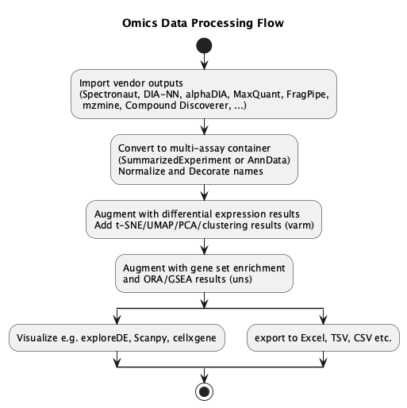

# Introduction

The **Omics Bridge** project establishes a standardized data format to facilitate multi-step, multi-tool analysis workflows in quantitative omics. By defining a common data container based on *AnnData*, this specification enables seamless data exchange between diverse analysis packages and visualization tools without requiring tool-specific adapters or format conversions.

## Project Goals

The primary goal is to create **self-sufficient data objects** that carry both:
- Quantitative measurements (expression matrices, intensities, counts)
- Rich metadata describing how to interpret these measurements (column roles, experimental factors, analysis provenance)

This self-describing approach allows downstream tools to discover and correctly interpret data without hard-coding assumptions about column names or structure.

## Participating Tools and Packages

The following tools and packages use this standardized format:

- **ezRun**: Workflow management and analysis orchestration
- **ezPyz**: Python-based quantification and analysis utilities
- **prolfqua**: Proteomics-focused differential expression and quality control
- **exploreDE**: Interactive visualization and exploration of differential expression results
- **Mass spectrometry data generators**: Tools that produce quantification outputs from raw MS data
- **Additional packages**: The specification is designed to be extensible for future tools

By adopting this common format, these tools can work together in flexible analysis pipelines where data flows naturally from quantification through statistical analysis to visualization.

---

# Use Case

## Harmonizing Omics Quantification Outputs for Downstream Analysis

Proteomics identification and quantification software — such as *Spectronaut*, *DIA-NN*, *alphaDIA*, *MaxQuant*, and *FragPipe* — produce results at various levels of biological aggregation, including *ion*, *peptidoform*, *protein*, *PTM site*, or *multisite* level.
Similarly, metabolomics tools such as *MZmine* or *Compound Discoverer*, and genomics analysis pipelines, generate quantitative data tables with differing structures, column names, and metadata conventions.

For proteomics, specialized importers parse and normalize diverse table structures, transforming them into standardized data objects that enable robust differential expression analysis. However, changes in upstream output formats can easily break compatibility, as importers depend on specific column naming and structure conventions.

Projects like *ProteoBench* provide parsers for many proteomics quantification tools, and could be extended to export data directly into *AnnData*.

Structural changes to data schemas can disrupt compatibility with visualization and downstream tools.

To summarize:

- Different omics technologies rely on diverse software ecosystems, and our goal is to interconnect them with analysis and visualization tools in a scalable way.
- It is unrealistic for every downstream application (for differential expression, enrichment, or visualization) to natively handle the idiosyncrasies of all upstream quantification tools and omics modalities.
- Maintaining extensive mapping tables between software packages becomes complex and fragile.

Therefore, an **intermediate data format** is needed—one that is both:

- **flexible enough** to represent omics- and tool-specific features,
- yet **simple enough** to be generated easily, in a preprocessing step.

The guiding principle for this format is to minimize requirements imposed on tool developers when writing into this format, while maintaining semantic richness for downstream interoperability.

**Workflow:**

1. **Convert** raw quantification outputs into a multi-assay data container (*AnnData*).
2. **Add conversion support** for various quantification applications to ensure integration.
3. **Run the DE application**, starting from the multi-assay container and appending differential expression results.
4. **Run the GSEA/ORA application**, which adds functional enrichment results.
5. **Visualize** integrated quantitative and functional data in applications such as *exploreDE*.



This modular architecture allows interoperability across tools, omics domains, and institutions, ensuring long-term sustainability and reproducibility of quantitative omics analyses.

## Contract: "Essential Data" for Tool Interoperability

To make multiple omics tools work on a common container without brittle per-exporter adapters/importers, each downstream tool (*exploreDE*, *prolfquaDE*) that operates on *AnnData* must publish an **essential set** of required data and metadata.

The goal is a **minimal, stable contract**: enough information to fully support the tool's features, while **abstaining from non-essential requirements** that complicate *AnnData* creation.

Each tool also implements a validator (function, tool, or script) that allows easy checking of whether the multi-assay container file will work.

**Principles**

1. **Essential-only**: Keep required fields to the minimum needed for the tool's core functionality. Avoid nice-to-haves.
   - Some additional metadata (e.g., sample annotations or contrasts) can be added when using a tool; therefore, there is no need to add it to the *AnnData* object at the beginning.

2. **Metadata-first column roles**: Encode column semantics using **application-specific metadata**.
   - Different applications define their own requirements (e.g., `uns['exploreDE']['column_roles']`), not forced column name prefixes.
   - Optional: Use column prefixes for convenience (auto-discovered if metadata is missing).

3. **Tool-specific contracts**: Each tool (e.g., *exploreDE*, *prolfqua* DE) documents its **essential contract**. Upstream writers and importers target the contract—**not** tool-internal structures—by adding annotations to the *AnnData* object.


---

# Column Annotation Strategy

## Flexible Column Naming with Metadata

**Key Principle:** Column names are **arbitrary**—their semantic meaning is defined in **application-specific metadata** (e.g., `uns['exploreDE']['column_roles']`), not by naming convention.

This approach:

- Accepts data from any source without renaming columns.
- Preserves original column names from upstream tools.
- Enables multi-tool interoperability (each tool defines its own requirements).
- Optional: Auto-discovers prefixed columns for convenience.

---

# AnnData Structure Overview

AnnData components:

| Component | AnnData Slot | Description |
|-----------|--------------|-------------|
| Features  | `var/varm`   | Annotation of variables/features (gene/protein/metabolite annotations and DE results) |
| Samples   | `obs/obsm`   | Annotation of observations (sample metadata and experimental factors) |
| Counts    | `X`/`layers` | Raw/normalized/transformed abundance matrices |
| Other     | `uns`        | Unstructured metadata (column roles, pathways, settings) |

---

# exploreDE Specification

This section defines the *exploreDE*-specific requirements for column roles. Other tools (e.g., *prolfqua*) may define different requirements in their own sections.

## Column Roles Metadata Structure

Column roles are organized by **location** in the AnnData object:

::: {.panel-tabset}

## Python


```{python}
import anndata as ad
import numpy as np
import pandas as pd

# Example: Create AnnData with arbitrary column names
np.random.seed(42)
intensities = np.random.lognormal(mean=10, sigma=2, size=(100, 50))

obs = pd.DataFrame({
    'sample_id': [f'sample_{i:03d}' for i in range(100)],
    'condition': ['control'] * 50 + ['treated'] * 50,  # No prefix!
    'batch': np.random.choice(['batch1', 'batch2'], 100)
}, index=[f'sample_{i:03d}' for i in range(100)])

var = pd.DataFrame({
    'protein_id': [f'P{i:05d}' for i in range(50)],
    'description': [f'Protein {i}' for i in range(50)],
    'gene_symbol': [f'GENE{i}' for i in range(50)]  # No prefix!
}, index=[f'P{i:05d}' for i in range(50)])

adata = ad.AnnData(X=intensities, obs=obs, var=var)
adata.obs.index.name = 'sample_id'
adata.var.index.name = 'protein_id'

# Define column roles for exploreDE (application-specific!)
adata.uns['exploreDE'] = {
    'column_roles': {
        'var': {
            # Feature-level annotations (shared across all analyses)
            'description': ['description'],  # REQUIRED by exploreDE!
            'label': ['gene_symbol', 'protein_id']
        },
        'obs': {
            # Sample-level metadata
            'factor': ['condition', 'batch'],  # REQUIRED
            'label': ['sample_id']
        }
        # DE test column roles will be added directly here (not nested under 'varm')
        # e.g., 'DE_treated_vs_control': {
        #     'effect': ['logFC', 'beta'],  # REQUIRED
        #     'score': ['pvalue', 'padj'],  # REQUIRED (at least one)
        #     'label': ['t_statistic', 'base_mean']  # Optional
        # }
    },
    'de_tests': {
        # Will store DE test metadata (formula, contrasts, etc.)
    }
}

print(f"Created AnnData: {adata.n_obs} samples × {adata.n_vars} proteins")
print(f"exploreDE config keys: {list(adata.uns['exploreDE'].keys())}")
```

## R

```{r}
library(anndataR)

# Example: Create AnnData with arbitrary column names
set.seed(42)
intensities <- matrix(rlnorm(100 * 50, meanlog=10, sdlog=2), nrow=100, ncol=50)

obs <- data.frame(
    sample_id = sprintf('sample_%03d', 0:99),
    condition = rep(c('control', 'treated'), each=50),  # No prefix!
    batch = sample(c('batch1', 'batch2'), 100, replace=TRUE),
    row.names = sprintf('sample_%03d', 0:99)
)

var <- data.frame(
    protein_id = sprintf('P%05d', 0:49),
    description = sprintf('Protein %d', 0:49),
    gene_symbol = sprintf('GENE%d', 0:49),  # No prefix!
    row.names = sprintf('P%05d', 0:49)
)

adata <- AnnData(
    X = intensities,
    obs = obs,
    var = var
)

# Define column roles for exploreDE (application-specific!)
adata$uns[['exploreDE']] <- list(
    column_roles = list(
        var = list(
            # Feature-level annotations (shared across all analyses)
            description = list('description'),  # REQUIRED by exploreDE!
            label = list('gene_symbol', 'protein_id')
        ),
        obs = list(
            # Sample-level metadata
            factor = list('condition', 'batch'),  # REQUIRED
            label = list('sample_id')
        )
        # DE test column roles will be added directly here (not nested under 'varm')
    ),
    de_tests = list()
)

cat(sprintf("Created AnnData: %d samples × %d proteins\n", nrow(adata), ncol(adata)))
cat(sprintf("exploreDE config keys: %s\n", paste(names(adata$uns$exploreDE), collapse=", ")))
```

:::


**Key distinctions:**

- **`column_roles['var']`**: Feature-level annotations.
  - `description`: REQUIRED by *exploreDE* (free-text searchable field).
  - `label`: Optional identifiers used for filtering.
- **`column_roles['obs']`**: Sample-level metadata.
  - `factor`: REQUIRED (at least one experimental factor).
- **`column_roles['DE_*']`**: DE results per contrast (stored in varm).
  - `effect`: REQUIRED (fold change column).
  - `score`: REQUIRED (at least one significance column).

---

## X and Layers (Counts / Abundances / Intensities)

Abundance matrices are stored in AnnData `X` and `layers`. In AnnData, rows = observations (samples), columns = variables (features).

**The `X` matrix** holds the primary data matrix. While `layers` have explicit names, `X` does not have a name attribute in the AnnData structure. To track what transformation is stored in `X`, document this in `adata.uns` (e.g., `adata.uns['X_layer_name'] = 'log2_intensity'`).

**Layer names** should be descriptive of the data type or transformation applied (e.g., `counts`, `tpm`, `vst`, `log2_tpm`, `intensities`).

The distribution of the data (exponential, Poisson, normal) is **not encoded in the layer name**. Instead, tools determine the sampling distribution statistically when needed for visualization or analysis.

**Important:** Document in `adata.uns` which layer (or `X`) was used for each DE test.

| Layer Type | Description | Examples |
|:-----------|:------------|:---------|
| Numeric abundance | Raw, normalized, or transformed abundance data | `counts`, `tpm`, `fpkm`, `intensities` |
| Transformed abundance | Log-transformed or variance-stabilized data | `log2_tpm`, `vst`, `voom`, `vsn` |
| Metadata matrices | Feature-specific annotations per sample | `nr_peptides`, `stdev`, `retention_time` |

**Example: Adding multiple data layers**

::: {.panel-tabset}

## Python 

```{python}
# Create a fresh AnnData object for this example
np.random.seed(123)
raw_intensities = np.random.lognormal(mean=12, sigma=1.5, size=(50, 30))

sample_data = pd.DataFrame({
    'sample': [f'S{i:03d}' for i in range(50)],
    'group': ['A', 'B'] * 25
}, index=[f'S{i:03d}' for i in range(50)])

feature_data = pd.DataFrame({
    'feature_id': [f'F{i:03d}' for i in range(30)],
    'name': [f'Feature_{i}' for i in range(30)]
}, index=[f'F{i:03d}' for i in range(30)])

adata_layers = ad.AnnData(X=raw_intensities, obs=sample_data, var=feature_data)

# Store raw intensities in a named layer
adata_layers.layers['intensities'] = adata_layers.X.copy()

# Log2-transform and store in X
adata_layers.X = np.log2(adata_layers.X + 1)  # +1 to handle zeros
adata_layers.uns['X_layer_name'] = 'log2_intensity'  # Document what X contains

# Add z-score normalized version
adata_layers.layers['zscore'] = (adata_layers.X - adata_layers.X.mean(axis=0)) / adata_layers.X.std(axis=0)

print(f"Available layers: {list(adata_layers.layers.keys())}")
print(f"X contains: {adata_layers.uns['X_layer_name']}")
```

## R

```{r}
# Create a fresh AnnData object for this example
set.seed(123)
raw_intensities <- matrix(rlnorm(50 * 30, meanlog=12, sdlog=1.5), nrow=50, ncol=30)

sample_data <- data.frame(
    sample = sprintf('S%03d', 0:49),
    group = rep(c('A', 'B'), 25),
    row.names = sprintf('S%03d', 0:49)
)

feature_data <- data.frame(
    feature_id = sprintf('F%03d', 0:29),
    name = sprintf('Feature_%d', 0:29),
    row.names = sprintf('F%03d', 0:29)
)

adata_layers <- AnnData(X = raw_intensities, obs = sample_data, var = feature_data)

# Store raw intensities in a named layer
adata_layers$layers[['intensities']] <- adata_layers$X

# Log2-transform and store in X
adata_layers$X <- log2(adata_layers$X + 1)  # +1 to handle zeros
adata_layers$uns[['X_layer_name']] <- 'log2_intensity'  # Document what X contains

# Add z-score normalized version
adata_layers$layers[['zscore']] <- scale(adata_layers$X)

cat(sprintf("Available layers: %s\n", paste(names(adata_layers$layers), collapse=", ")))
cat(sprintf("X contains: %s\n", adata_layers$uns$X_layer_name))
```

:::


---

## var and varm (Features)

Feature annotations and differential expression results are stored in `var` and `varm`.

We can store genes, proteins, peptides, metabolites, etc. in the `var` container.

### Feature Identifiers (Index)

The `var` DataFrame index (`adata.var.index` in Python, `rownames(adata$var)` in R) serves as the **unique identifier** for each feature:

- **Must be unique**: Each feature must have a distinct identifier.
- **Must match across components**: The same identifiers must be used in `X`, `layers`, and `varm`.
- **Index name**: Set `adata.var.index.name` to indicate the type (e.g., `'gene_id'`, `'protein_id'`, `'peptide_id'`).

**Example**:

```python
# Python: Feature index is set when creating var DataFrame
var = pd.DataFrame({
    'description': ['Gene A function', 'Gene B function'],
    'gene_symbol': ['GENE_A', 'GENE_B']
}, index=['ENSG00000001', 'ENSG00000002'])  # Unique Ensembl IDs

adata = ad.AnnData(X=data, var=var, obs=obs)
adata.var.index.name = 'gene_id'  # Document what the index represents
```

```r
# R: Feature index is set via row.names
var <- data.frame(
    description = c('Gene A function', 'Gene B function'),
    gene_symbol = c('GENE_A', 'GENE_B'),
    row.names = c('ENSG00000001', 'ENSG00000002')  # Unique Ensembl IDs
)

adata <- AnnData(X = data, var = var, obs = obs)
# Row names are automatically used as the index
```


### Feature Annotation Table

**Single table shared across all DE tests in the AnnData object.**

All columns can be used for filtering and subsetting. Column types (string, integer, numeric) determine available filter operations.

**Column names are arbitrary**—their roles are defined in application-specific metadata.

**Requirements for `var`:**

| Role | Required? | Description | Examples |
|------|-----------|-------------|----------|
| `description` | **Yes** | Free-text searchable description | `description`, `Protein.names`, `Gene description` |
| `label` | No | Human-readable identifiers | `gene_symbol`, `Gene.names`, `protein_id`, `Protein.IDs`, `uniprot_id` |

**Note:** Other tools may define different requirements (e.g., `hierarchy` for proteomics rollup tools).

**Example: Adding feature annotations with arbitrary names**

::: {.panel-tabset}

## Python

```{python}
# Create fresh AnnData for feature annotations example
np.random.seed(456)
protein_data = np.random.lognormal(mean=10, sigma=2, size=(40, 25))

obs_annot = pd.DataFrame({
    'sample': [f'S{i:03d}' for i in range(40)],
    'condition': ['ctrl', 'treat'] * 20
}, index=[f'S{i:03d}' for i in range(40)])

var_annot = pd.DataFrame({
    'protein_id': [f'P{i:05d}' for i in range(25)],
    'description': [f'Protein {i} function' for i in range(25)],
    'gene_symbol': [f'GENE{i}' for i in range(25)]
}, index=[f'P{i:05d}' for i in range(25)])

adata_features = ad.AnnData(X=protein_data, obs=obs_annot, var=var_annot)

# Add more annotations with any column names you want
adata_features.var['uniprot_id'] = [f'UNI{i:05d}' for i in range(adata_features.n_vars)]
adata_features.var['nr_peptides'] = np.random.randint(2, 50, adata_features.n_vars)
adata_features.var['mean_intensity'] = adata_features.X.mean(axis=0)

# Define column roles for exploreDE
adata_features.uns['exploreDE'] = {
    'column_roles': {
        'var': {
            'description': ['description'],  # REQUIRED
            'label': ['gene_symbol', 'protein_id', 'uniprot_id', 'nr_peptides', 'mean_intensity']
        },
        'obs': {
            'factor': ['condition'],
            'label': ['sample']
        }
    },
    'de_tests': {}
}

print(f"Feature annotations: {list(adata_features.var.columns)}")
print(f"Label columns: {adata_features.uns['exploreDE']['column_roles']['var']['label']}")
```

## R

```{r}
# Create fresh AnnData for feature annotations example
set.seed(456)
protein_data <- matrix(rlnorm(40 * 25, meanlog=10, sdlog=2), nrow=40, ncol=25)

obs_annot <- data.frame(
    sample = sprintf('S%03d', 0:39),
    condition = rep(c('ctrl', 'treat'), 20),
    row.names = sprintf('S%03d', 0:39)
)

var_annot <- data.frame(
    protein_id = sprintf('P%05d', 0:24),
    description = sprintf('Protein %d function', 0:24),
    gene_symbol = sprintf('GENE%d', 0:24),
    row.names = sprintf('P%05d', 0:24)
)

adata_features <- AnnData(X = protein_data, obs = obs_annot, var = var_annot)

# Add more annotations with any column names you want
adata_features$var$uniprot_id <- sprintf('UNI%05d', 0:24)
adata_features$var$nr_peptides <- sample(2:50, 25, replace=TRUE)
adata_features$var$mean_intensity <- colMeans(adata_features$X)

# Define column roles for exploreDE
adata_features$uns[['exploreDE']] <- list(
    column_roles = list(
        var = list(
            description = list('description'),  # REQUIRED
            label = list('gene_symbol', 'protein_id', 'uniprot_id', 'nr_peptides', 'mean_intensity')
        ),
        obs = list(
            factor = list('condition'),
            label = list('sample')
        )
    ),
    de_tests = list()
)

cat(sprintf("Feature annotations: %s\n", paste(colnames(adata_features$var), collapse=", ")))
cat(sprintf("Label columns: %s\n", paste(unlist(adata_features$uns$exploreDE$column_roles$var$label), collapse=", ")))
```

:::

---

### Differential Expression Results (varm)

**One set of columns per DE test performed.**

Each DE test is stored in `varm` as a **pandas DataFrame** (or R `data.frame`), accessed by a distinct name. The DataFrame must have the same index as `adata.var` (same length and order).

The DE table name format is: `DE_<name_of_contrast>` where `<name_of_contrast>` is a distinct identifier for this comparison.

#### DE Column Roles

For each DE test in `varm`, define column roles in `uns['exploreDE']['column_roles'][<de_test_name>]`:

| Role | Description | Common column names |
|------|-------------|---------------------|
| `effect` | Effect size (fold change) | `logFC`, `log2FC`, `log2FoldChange`, `lfc`, `beta` |
| `score` | Statistical significance | `pvalue`, `padj`, `FDR`, `q_value`, `adjusted_pval` |
| `label` | Additional statistics/metadata | `base_mean`, `baseMean`, `t_statistic`, `lfcSE`, `ci_upper`, `ci_lower` |

#### DE Test Metadata

In addition to column roles, store metadata about each DE test in `uns['exploreDE']['de_tests'][<de_test_name>]`. This metadata documents how the analysis was performed:

| Metadata Field | Description | Example |
|----------------|-------------|---------|
| `layer_used` | Which layer/matrix was used for the test | `'vst'`, `'log2_tpm'`, `'X'` |
| `factor_used` | Experimental factors included in the model | `['condition']`, `['treatment', 'batch']` |
| `contrast_formula` | The contrast being tested | `'treated - control'`, `'groupB - groupA'` |
| `model` | Statistical model/method used | `'DESeq2'`, `'limma'`, `'t-test'` |

This metadata is essential for:

- **Reproducibility**: Document which data and model were used.
- **Interpretation**: Understand the biological question being tested.
- **Tool compatibility**: Allow downstream tools to validate compatibility.

**Example: Storing DE results with original DESeq2 column names**

::: {.panel-tabset}

## Python

```{python}
# Simulate DESeq2-style results with original column names (no prefixes!)
de_results = pd.DataFrame({
    'log2FoldChange': np.random.randn(adata.n_vars),      # DESeq2 style
    'pvalue': np.random.uniform(0, 1, adata.n_vars),
    'padj': np.random.uniform(0, 1, adata.n_vars),
    'baseMean': np.random.uniform(100, 10000, adata.n_vars),
    'lfcSE': np.random.uniform(0.1, 1, adata.n_vars)
}, index=adata.var_names)

# Store in varm as DataFrame
adata.varm['DE_treated_vs_control'] = de_results

# Define column roles for this specific DE test (no 'varm' nesting - it's implicit)
adata.uns['exploreDE']['column_roles']['DE_treated_vs_control'] = {
    'effect': ['log2FoldChange'],
    'score': ['pvalue', 'padj'],
    'label': ['baseMean', 'lfcSE']
}

# Store metadata about the DE test in the de_tests section
adata.uns['exploreDE']['de_tests']['DE_treated_vs_control'] = {
    'layer_used': 'vst',
    'factor_used': ['condition'],
    'contrast_formula': 'treated - control',
    'model': 'DESeq2'
}

print(f"DE results stored: {adata.varm['DE_treated_vs_control'].shape}")
print(f"DE effect columns: {adata.uns['exploreDE']['column_roles']['DE_treated_vs_control']['effect']}")
print(f"DE score columns: {adata.uns['exploreDE']['column_roles']['DE_treated_vs_control']['score']}")
```

## R

```{r}
# Simulate DESeq2-style results with original column names (no prefixes!)
de_results <- data.frame(
    log2FoldChange = rnorm(ncol(adata)),      # DESeq2 style
    pvalue = runif(ncol(adata)),
    padj = runif(ncol(adata)),
    baseMean = runif(ncol(adata), 100, 10000),
    lfcSE = runif(ncol(adata), 0.1, 1),
    row.names = rownames(adata$var)
)

# Store in varm as DataFrame
adata$varm[['DE_treated_vs_control']] <- de_results

# Define column roles for this specific DE test (no 'varm' nesting - it's implicit)
adata$uns$exploreDE$column_roles[['DE_treated_vs_control']] <- list(
    effect = list('log2FoldChange'),
    score = list('pvalue', 'padj'),
    label = list('baseMean', 'lfcSE')
)

# Store metadata about the DE test in the de_tests section
adata$uns$exploreDE$de_tests[['DE_treated_vs_control']] <- list(
    layer_used = 'vst',
    factor_used = list('condition'),
    contrast_formula = 'treated - control',
    model = 'DESeq2'
)

cat(sprintf("DE results stored: %d × %d\n", nrow(de_results), ncol(de_results)))
cat(sprintf("DE effect columns: %s\n", paste(unlist(adata$uns$exploreDE$column_roles$DE_treated_vs_control$effect), collapse=", ")))
cat(sprintf("DE score columns: %s\n", paste(unlist(adata$uns$exploreDE$column_roles$DE_treated_vs_control$score), collapse=", ")))
```

:::


---

## obs and obsm (Samples/Observations)

Sample metadata and experimental design information stored in `obs`.

**Column names are arbitrary**—their roles are defined in application-specific metadata.

Recommended semantic roles:

| Role | Description | Examples |
|------|-------------|----------|
| `factor` | Experimental factors (conditions, covariates) | `condition`, `treatment`, `sex`, `batch`, `timepoint`, `genotype` |
| `label` | Sample identifiers and annotations | `sample_name`, `patient_id`, `barcode`, `QC_status` |

**Example: Using external tool column names (MaxQuant style)**

::: {.panel-tabset}

## Python

```{python}
# Create fresh AnnData with MaxQuant-style column names
np.random.seed(789)
mq_intensities = np.random.lognormal(mean=11, sigma=1.8, size=(60, 20))

# MaxQuant uses specific column naming (e.g., "Experiment", "Raw.file")
obs_mq = pd.DataFrame({
    'Experiment': ['Exp_A', 'Exp_B', 'Exp_C'] * 20,  # MaxQuant column name
    'Raw.file': [f'raw_file_{i:03d}.raw' for i in range(60)],  # Dots in names!
    'Batch': [1, 1, 2, 2, 3, 3] * 10
}, index=[f'sample_{i:03d}' for i in range(60)])

var_mq = pd.DataFrame({
    'Protein.IDs': [f'P{i:05d}' for i in range(20)],  # MaxQuant style
    'Gene.names': [f'GENE{i}' for i in range(20)],
    'Protein.names': [f'Protein {i} description' for i in range(20)]
}, index=[f'P{i:05d}' for i in range(20)])

adata_mq = ad.AnnData(X=mq_intensities, obs=obs_mq, var=var_mq)

# Map MaxQuant columns to exploreDE roles
adata_mq.uns['exploreDE'] = {
    'column_roles': {
        'var': {
            'description': ['Protein.names'],  # REQUIRED
            'label': ['Gene.names', 'Protein.IDs']
        },
        'obs': {
            'factor': ['Experiment', 'Batch'],
            'label': ['Raw.file']
        }
    },
    'de_tests': {}
}

print(f"Sample metadata columns: {list(adata_mq.obs.columns)}")
print(f"Factor columns: {adata_mq.uns['exploreDE']['column_roles']['obs']['factor']}")
```

## R

```{r}
# Create fresh AnnData with MaxQuant-style column names
set.seed(789)
mq_intensities <- matrix(rlnorm(60 * 20, meanlog=11, sdlog=1.8), nrow=60, ncol=20)

# MaxQuant uses specific column naming (e.g., "Experiment", "Raw.file")
obs_mq <- data.frame(
    Experiment = rep(c('Exp_A', 'Exp_B', 'Exp_C'), 20),  # MaxQuant column name
    Raw.file = sprintf('raw_file_%03d.raw', 0:59),  # Dots in names!
    Batch = rep(c(1, 1, 2, 2, 3, 3), 10),
    row.names = sprintf('sample_%03d', 0:59)
)

var_mq <- data.frame(
    Protein.IDs = sprintf('P%05d', 0:19),  # MaxQuant style
    Gene.names = sprintf('GENE%d', 0:19),
    Protein.names = sprintf('Protein %d description', 0:19),
    row.names = sprintf('P%05d', 0:19)
)

adata_mq <- AnnData(X = mq_intensities, obs = obs_mq, var = var_mq)

# Map MaxQuant columns to exploreDE roles
adata_mq$uns[['exploreDE']] <- list(
    column_roles = list(
        var = list(
            description = list('Protein.names'),  # REQUIRED
            label = list('Gene.names', 'Protein.IDs')
        ),
        obs = list(
            factor = list('Experiment', 'Batch'),
            label = list('Raw.file')
        )
    ),
    de_tests = list()
)

cat(sprintf("Sample metadata columns: %s\n", paste(colnames(adata_mq$obs), collapse=", ")))
cat(sprintf("Factor columns: %s\n", paste(unlist(adata_mq$uns$exploreDE$column_roles$obs$factor), collapse=", ")))
```

:::


---

## uns (Unstructured Metadata)

Unstructured metadata stored in `adata.uns`.

Required metadata:

- **`exploreDE`**: Application configuration with nested structure:
  - `column_roles`: Mapping of column names to semantic roles (var, obs, and DE test results).
  - `de_tests`: Metadata about differential expression tests.


**Example: Complete metadata structure**

::: {.panel-tabset}


## Python

```{python}
# Verify exploreDE structure
print("exploreDE structure:")
print("  column_roles keys:")
for key in adata.uns['exploreDE']['column_roles'].keys():
    print(f"    - {key}")
print("  de_tests keys:")
for key in adata.uns['exploreDE']['de_tests'].keys():
    print(f"    - {key}")
```

## R

```{r}
# Verify exploreDE structure
cat("exploreDE structure:\n")
cat("  column_roles keys:\n")
for (key in names(adata$uns$exploreDE$column_roles)) {
    cat(sprintf("    - %s\n", key))
}
cat("  de_tests keys:\n")
for (key in names(adata$uns$exploreDE$de_tests)) {
    cat(sprintf("    - %s\n", key))
}
```

:::


---

## Validation

Each tool should provide a validator to check if an AnnData object meets its requirements. The validator verifies the structure and metadata needed for the tool to function correctly.

**Implementation**: See `src/omicsbridge/validator.py` for a reference implementation.

### What the Validator Checks

The validator performs these checks:

1. **Basic structure**: Is the object an AnnData instance?
2. **Index uniqueness**: Are observation and variable indices unique?
3. **Required metadata**: Does `uns[app_name]['column_roles']` exist?
4. **Required sections**: Are `var` and `obs` column roles defined?
5. **Application-specific requirements**: Is the `description` role defined in `var`?
6. **DE test consistency**: Do referenced DE tests exist in `varm`? Do they have the required `effect` and `score` columns?

### Usage Example

```{python}
#| eval: false

# Import the validator (implementation in src/omicsbridge/validator.py)
from omicsbridge.validator import validate_anndata_omics

# Validate an AnnData object
result = validate_anndata_omics(adata, app_name='exploreDE')

# Check results
print(f"Validation status: {result['overall_status']}")

if result['errors']:
    print("\nErrors (must fix):")
    for error in result['errors']:
        print(f"  - {error}")

if result['warnings']:
    print("\nWarnings (recommended to address):")
    for warning in result['warnings']:
        print(f"  - {warning}")
```

**Example output**:

```
Validation status: PASS

Warnings (recommended to address):
  - exploreDE missing 'de_tests' section (OK if no DE has been performed)
```

### Saving and Loading AnnData Objects

The standard format for AnnData is HDF5-based `.h5ad` files, which efficiently store all components.

::: {.panel-tabset}

## Python

```{python}
#| eval: false

# Save AnnData object (includes column_roles metadata)
adata.write('proteomics_experiment.h5ad')

# Load AnnData object
adata_loaded = ad.read_h5ad('proteomics_experiment.h5ad')

# Verify exploreDE config was preserved
print(f"Loaded exploreDE keys: {list(adata_loaded.uns['exploreDE'].keys())}")
print(f"Description column in var: {adata_loaded.uns['exploreDE']['column_roles']['var']['description']}")
print(f"Label columns in var: {adata_loaded.uns['exploreDE']['column_roles']['var']['label']}")
```

## R

```{r}
#| eval: false

# Save AnnData object (includes column_roles metadata)
adata$write_h5ad('proteomics_experiment_r.h5ad')

# Load AnnData object
adata_loaded <- read_h5ad('proteomics_experiment_r.h5ad')

# Verify exploreDE config was preserved
cat(sprintf("Loaded exploreDE keys: %s\n", paste(names(adata_loaded$uns$exploreDE), collapse=", ")))
cat(sprintf("Description column in var: %s\n", paste(unlist(adata_loaded$uns$exploreDE$column_roles$var$description), collapse=", ")))
cat(sprintf("Label columns in var: %s\n", paste(unlist(adata_loaded$uns$exploreDE$column_roles$var$label), collapse=", ")))
```

:::


---

# prolfqua Column Roles

The *prolfqua* package uses AnnData for hierarchical proteomics data (e.g., peptide-to-protein relationships). Unlike *exploreDE*, which works at a single aggregation level, *prolfqua* requires hierarchy information for data rollup operations.

## Hierarchical Data Columns

For proteomics and other hierarchical omics data, store multi-level relationships in separate columns. Individual hierarchy columns may contain duplicates, but **all hierarchy columns combined must uniquely identify each row**.

**Hierarchy metadata** is stored in `uns['prolfqua']['hierarchy']` (not in `uns['exploreDE']`).

**Example: Creating hierarchical peptide-level data**

::: {.panel-tabset}

## Python

```{python}
# Create peptide-level AnnData (multiple peptides per protein)
np.random.seed(999)
n_peptides = 200
peptide_intensities = np.random.lognormal(mean=8, sigma=2, size=(60, n_peptides))

# Sample metadata (same across hierarchy levels)
peptide_obs = pd.DataFrame({
    'sample': [f'S{i:03d}' for i in range(60)],
    'group': ['A', 'B'] * 30
}, index=[f'S{i:03d}' for i in range(60)])

# Peptide annotations with hierarchy
peptide_var = pd.DataFrame({
    'peptide_id': [f'PEP_{i:05d}' for i in range(n_peptides)],
    'description': [f'Peptide sequence {i}' for i in range(n_peptides)],
    'protein': np.random.choice([f'P{i:05d}' for i in range(50)], n_peptides),
    'peptide_seq': [f'PEPTIDE{i}K' for i in range(n_peptides)]
}, index=[f'PEP_{i:05d}' for i in range(n_peptides)])

adata_peptide = ad.AnnData(X=peptide_intensities, obs=peptide_obs, var=peptide_var)
adata_peptide.obs.index.name = 'sample_id'
adata_peptide.var.index.name = 'peptide_id'

# Define hierarchy for prolfqua (separate from exploreDE)
adata_peptide.uns['prolfqua'] = {
    'hierarchy': ['protein', 'peptide_seq']  # Columns defining the hierarchy
}

print(f"Peptide data: {adata_peptide.n_vars} peptides mapping to ~50 proteins")
print(f"Hierarchy columns: {adata_peptide.uns['prolfqua']['hierarchy']}")
```

## R

```{r}
# Create peptide-level AnnData (multiple peptides per protein)
set.seed(999)
n_peptides <- 200
peptide_intensities <- matrix(rlnorm(60 * n_peptides, meanlog=8, sdlog=2), nrow=60, ncol=n_peptides)

# Sample metadata (same across hierarchy levels)
peptide_obs <- data.frame(
    sample = sprintf('S%03d', 0:59),
    group = rep(c('A', 'B'), 30),
    row.names = sprintf('S%03d', 0:59)
)

# Peptide annotations with hierarchy
peptide_var <- data.frame(
    peptide_id = sprintf('PEP_%05d', 0:(n_peptides-1)),
    description = sprintf('Peptide sequence %d', 0:(n_peptides-1)),
    protein = sample(sprintf('P%05d', 0:49), n_peptides, replace=TRUE),
    peptide_seq = sprintf('PEPTIDE%dK', 0:(n_peptides-1)),
    row.names = sprintf('PEP_%05d', 0:(n_peptides-1))
)

adata_peptide <- AnnData(
    X = peptide_intensities,
    obs = peptide_obs,
    var = peptide_var
)

# Define hierarchy for prolfqua (separate from exploreDE)
adata_peptide$uns[['prolfqua']] <- list(
    hierarchy = list('protein', 'peptide_seq')  # Columns defining the hierarchy
)

cat(sprintf("Peptide data: %d peptides mapping to ~50 proteins\n", ncol(adata_peptide)))
cat(sprintf("Hierarchy columns: %s\n", paste(unlist(adata_peptide$uns$prolfqua$hierarchy), collapse=", ")))
```

:::


---

# Working with Column Roles: The ColumnResolver

The `ColumnResolver` class abstracts away column name differences, allowing tools to access data by **semantic role** rather than hard-coded column names. This enables tools to work with data from any source (*MaxQuant*, *DESeq2*, *Spectronaut*, etc.) without modification.

**Implementation**: See `src/omicsbridge/column_resolver.py` (Python) and `docs/R/column_resolver.R` (R) for the full implementation.

**Key Methods**:

- `get_columns(role, location, de_test)`: Get all columns matching a role.
- `get_primary_column(role, location, de_test)`: Get the first column for a role.

**Usage Example**:

::: {.panel-tabset}

## Python

```{python}
#| eval: false

# Import the ColumnResolver (implementation in src/omicsbridge/column_resolver.py)
from omicsbridge.column_resolver import ColumnResolver

# Create resolver for an AnnData object
resolver = ColumnResolver(adata, app_name='exploreDE')

# Access columns by semantic role (not by hard-coded names!)
desc_col = resolver.get_primary_column('description', location='var')
factor_cols = resolver.get_columns('factor', location='obs')

# Works with any DE test, regardless of column names
effect_col = resolver.get_primary_column('effect', de_test='DE_treated_vs_control')
pval_cols = resolver.get_columns('score', de_test='DE_treated_vs_control')

# Use in visualization code
print(f"Volcano plot X-axis: {effect_col}")  # Might be 'logFC', 'log2FoldChange', etc.
print(f"Volcano plot Y-axis: {pval_cols[0]}")  # Might be 'pvalue', 'padj', 'FDR', etc.
```

## R

```{r}
#| eval: false

# Source the ColumnResolver (implementation in docs/R/column_resolver.R)
source('R/column_resolver.R')

# Create resolver for an AnnData object
resolver <- ColumnResolver$new(adata, app_name = 'exploreDE')

# Access columns by semantic role (not by hard-coded names!)
desc_col <- resolver$get_primary_column('description', location = 'var')
factor_cols <- resolver$get_columns('factor', location = 'obs')

# Works with any DE test, regardless of column names
effect_col <- resolver$get_primary_column('effect', de_test = 'DE_treated_vs_control')
pval_cols <- resolver$get_columns('score', de_test = 'DE_treated_vs_control')

# Use in visualization code
cat(sprintf("Volcano plot X-axis: %s\n", effect_col))  # Might be 'logFC', 'log2FoldChange', etc.
cat(sprintf("Volcano plot Y-axis: %s\n", pval_cols[1]))  # Might be 'pvalue', 'padj', 'FDR', etc.
```

:::


---

# Version History

| Date | Version | Changes |
|------|---------|---------|
| 2025-11-12 | 2.0 | Flexible column annotation with metadata-based roles |
| 2025-11-12 | 1.0 | Initial AnnData-focused specification |

---

# References

- [AnnData documentation](https://anndata.readthedocs.io/)
- [Architecture Decision: Column Annotation Strategy](architecture_decision_column_annotation.md)
- [scanpy documentation](https://scanpy.readthedocs.io/)

