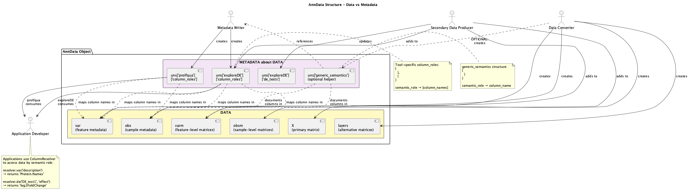

# AnnData Python API Reference for Claude Code

**Version**: AnnData 0.10+  
**Documentation**: https://anndata.readthedocs.io/  
**Source**: https://github.com/scverse/anndata  
**Installation**: `pip install anndata`

---

## Overview

AnnData (Annotated Data) is a Python package for handling annotated data matrices. It's the core data structure of the scverse ecosystem (scanpy, scvi-tools, squidpy, etc.) and is widely used for single-cell analysis, but works for any matrix data with annotations.



**Key concept**: Store a data matrix `X` (observations × variables) with:
- **obs**: Metadata about observations (rows) - e.g., cells, samples
- **var**: Metadata about variables (columns) - e.g., genes, features
- **uns**: Unstructured global metadata
- **layers**: Alternative matrices with same dimensions as `X`
- **obsm/varm**: Multi-dimensional arrays linked to obs/var
- **obsp/varp**: Pairwise relationships between obs/var

---

## Table of Contents

1. [Core Data Structure](#core-data-structure)
2. [Creating AnnData Objects](#creating-anndata-objects)
3. [Accessing Data](#accessing-data)
4. [Modifying Data](#modifying-data)
5. [Subsetting and Indexing](#subsetting-and-indexing)
6. [File I/O](#file-io)
7. [Views vs Copies](#views-vs-copies)
8. [Sparse Matrix Support](#sparse-matrix-support)
9. [Common Operations](#common-operations)
10. [Best Practices](#best-practices)

---

## Core Data Structure

```python
import anndata as ad
import numpy as np
import pandas as pd

# Complete structure
adata = ad.AnnData(
    X=...,        # Main data matrix (n_obs × n_vars)
    obs=...,      # Observation metadata (DataFrame, n_obs rows)
    var=...,      # Variable metadata (DataFrame, n_vars rows)
    uns=...,      # Unstructured annotation (dict)
    obsm=...,     # Multi-dimensional observation annotation (dict of arrays)
    varm=...,     # Multi-dimensional variable annotation (dict of arrays)
    layers=...,   # Additional data matrices (dict, same shape as X)
    obsp=...,     # Pairwise observation data (e.g., graphs, distances)
    varp=...      # Pairwise variable data
)
```

### Component Overview

| Attribute | Type | Dimensions | Description | Example Use Case |
|-----------|------|------------|-------------|------------------|
| `X` | array/sparse | n_obs × n_vars | Primary data matrix | Gene expression, intensity values |
| `obs` | DataFrame | n_obs × p | Observation annotations | Cell types, sample conditions, time points |
| `var` | DataFrame | n_vars × q | Variable annotations | Gene names, protein IDs, genomic coordinates |
| `uns` | dict | - | Unstructured metadata | Analysis parameters, software versions |
| `layers` | dict | n_obs × n_vars | Alternative matrices | Raw counts, normalized values, imputations |
| `obsm` | dict | n_obs × m | Multi-dimensional obs data | PCA coordinates, embeddings |
| `varm` | dict | n_vars × k | Multi-dimensional var data | PC loadings, gene modules |
| `obsp` | dict | n_obs × n_obs | Pairwise obs relationships | Cell-cell graphs, distance matrices |
| `varp` | dict | n_vars × n_vars | Pairwise var relationships | Gene-gene correlations, networks |

### Key Properties

```python
adata.n_obs      # Number of observations (rows)
adata.n_vars     # Number of variables (columns)
adata.obs_names  # Observation names (index of obs DataFrame)
adata.var_names  # Variable names (index of var DataFrame)
adata.shape      # (n_obs, n_vars)
adata.is_view    # Boolean: is this a view or copy?
```

---

## Creating AnnData Objects

### Minimal Creation

```python
import anndata as ad
import numpy as np

# From matrix only
X = np.random.rand(100, 50)
adata = ad.AnnData(X)

# Sparse matrix
from scipy.sparse import csr_matrix
X_sparse = csr_matrix(X)
adata = ad.AnnData(X_sparse)
```

### With Metadata

```python
import pandas as pd

# Create data and metadata
X = np.random.rand(100, 50)

obs = pd.DataFrame({
    'cell_type': np.random.choice(['TypeA', 'TypeB', 'TypeC'], 100),
    'batch': ['batch1'] * 50 + ['batch2'] * 50,
    'n_counts': np.random.poisson(1000, 100)
}, index=[f'cell_{i}' for i in range(100)])

var = pd.DataFrame({
    'gene_name': [f'Gene{i}' for i in range(50)],
    'highly_variable': np.random.choice([True, False], 50)
}, index=[f'GENE{i:03d}' for i in range(50)])

# Create AnnData
adata = ad.AnnData(X=X, obs=obs, var=var)

# Set index names (best practice)
adata.obs.index.name = 'cell_id'
adata.var.index.name = 'gene_id'
```

### With All Components

```python
# Unstructured metadata
uns = {
    'experiment': 'RNA-seq',
    'date': '2025-01-01',
    'parameters': {'threshold': 0.05}
}

# Multiple data layers
layers = {
    'counts': np.random.poisson(5, (100, 50)),
    'log1p': np.log1p(np.random.poisson(5, (100, 50))),
    'scaled': np.random.randn(100, 50)
}

# Multi-dimensional annotations
obsm = {
    'X_pca': np.random.rand(100, 10),     # PCA coordinates
    'X_umap': np.random.rand(100, 2),     # UMAP coordinates
    'X_tsne': np.random.rand(100, 2)      # t-SNE coordinates
}

varm = {
    'PCs': np.random.rand(50, 10),        # Principal components
    'gene_scores': np.random.rand(50, 5)  # Custom scores
}

# Create complete AnnData
adata = ad.AnnData(
    X=X,
    obs=obs,
    var=var,
    uns=uns,
    layers=layers,
    obsm=obsm,
    varm=varm
)
```

### From pandas DataFrame

```python
# DataFrame with samples as rows, genes as columns
df = pd.DataFrame(
    np.random.rand(100, 50),
    index=[f'sample_{i}' for i in range(100)],
    columns=[f'gene_{i}' for i in range(50)]
)

# Direct conversion
adata = ad.AnnData(df)

# With separate metadata
adata = ad.AnnData(
    X=df.values,
    obs=pd.DataFrame({'condition': ['A', 'B'] * 50}, index=df.index),
    var=pd.DataFrame({'type': 'protein_coding'}, index=df.columns)
)
```

---

## Accessing Data

### Main Matrix

```python
# Access X
adata.X               # Full matrix
adata.X[0, :]         # First observation (all variables)
adata.X[:, 0]         # First variable (all observations)
adata.X[0, 0]         # Single element

# As DataFrame
df = adata.to_df()    # X as DataFrame with names
```

### Metadata Access

```python
# Observation metadata
adata.obs                          # Full DataFrame
adata.obs['cell_type']             # Single column (Series)
adata.obs[['cell_type', 'batch']]  # Multiple columns (DataFrame)
adata.obs.loc['cell_0']            # Single observation
adata.obs.iloc[0]                  # By position

# Variable metadata
adata.var                          # Full DataFrame
adata.var['gene_name']             # Single column
adata.var.loc['GENE001']           # Single variable
```

### Layers

```python
# Access specific layer
counts = adata.layers['counts']
log_data = adata.layers['log1p']

# Check available layers
list(adata.layers.keys())

# Iterate over layers
for name, matrix in adata.layers.items():
    print(f"{name}: shape {matrix.shape}")

# Safe access with default
matrix = adata.layers.get('missing_layer', adata.X)
```

### Multi-dimensional Annotations

```python
# Access obsm
pca_coords = adata.obsm['X_pca']       # Shape: (n_obs, n_components)
umap_coords = adata.obsm['X_umap']     # Shape: (n_obs, 2)

# Access varm
loadings = adata.varm['PCs']           # Shape: (n_vars, n_components)

# List available
list(adata.obsm.keys())
list(adata.varm.keys())
```

### Unstructured Metadata

```python
# Access uns
adata.uns                              # Full dict
adata.uns['experiment']                # Specific key
adata.uns['parameters']['threshold']   # Nested access

# Check if key exists
if 'experiment' in adata.uns:
    print(adata.uns['experiment'])
```

### Names and Indices

```python
# Get names
obs_names = adata.obs_names            # or adata.obs.index
var_names = adata.var_names            # or adata.var.index

# Access by position
first_obs = adata.obs_names[0]
first_var = adata.var_names[0]

# Check uniqueness
assert adata.obs_names.is_unique
assert adata.var_names.is_unique

# Get index name
obs_index_name = adata.obs.index.name
var_index_name = adata.var.index.name
```

---

## Modifying Data

### Adding/Modifying obs and var

```python
# Add new columns
adata.obs['new_metric'] = np.random.rand(adata.n_obs)
adata.var['important'] = np.random.choice([True, False], adata.n_vars)

# Modify existing columns
adata.obs['cell_type'] = adata.obs['cell_type'].astype('category')
adata.var['highly_variable'] = adata.var['highly_variable'].astype(bool)

# Computed columns
adata.obs['log_counts'] = np.log1p(adata.obs['n_counts'])
adata.var['mean_expression'] = adata.X.mean(axis=0).A1  # For sparse

# Delete columns
del adata.obs['new_metric']
adata.obs = adata.obs.drop(columns=['old_column'])
```

### Modifying X

```python
# Replace X entirely
adata.X = new_matrix

# In-place transformations
adata.X = np.log1p(adata.X)

# Normalization (for dense)
adata.X = adata.X / adata.X.sum(axis=1, keepdims=True) * 1e4

# For sparse matrices
from scipy.sparse import issparse
if issparse(adata.X):
    # Library size normalization
    lib_size = np.array(adata.X.sum(axis=1)).flatten()
    adata.X = adata.X.multiply(1 / lib_size[:, None]) * 1e4
```

### Adding/Modifying Layers

```python
# Add new layer
adata.layers['normalized'] = adata.X / adata.X.sum(axis=1, keepdims=True)

# From existing layer
adata.layers['log_counts'] = np.log1p(adata.layers['counts'])

# Replace layer
adata.layers['counts'] = new_counts_matrix

# Delete layer
del adata.layers['old_layer']

# Move X to layer before transformation
adata.layers['raw'] = adata.X.copy()
adata.X = np.log1p(adata.X)
```

### Modifying obsm/varm

```python
# Add arrays
adata.obsm['X_diffmap'] = np.random.rand(adata.n_obs, 3)
adata.varm['loadings'] = np.random.rand(adata.n_vars, 10)

# Modify existing
adata.obsm['X_pca'] = new_pca_coordinates

# Delete
del adata.obsm['X_tsne']
```

### Modifying uns

```python
# Add simple values
adata.uns['n_pcs'] = 50
adata.uns['resolution'] = 1.0

# Add complex structures
adata.uns['analysis_info'] = {
    'date': '2025-01-01',
    'analyst': 'researcher',
    'version': '1.0'
}

# Nested modifications
if 'parameters' not in adata.uns:
    adata.uns['parameters'] = {}
adata.uns['parameters']['n_neighbors'] = 15

# Delete
del adata.uns['old_key']
```

### Renaming

```python
# Rename observations
adata.obs_names = [f'cell_{i}' for i in range(adata.n_obs)]

# Rename variables
adata.var_names = [f'gene_{i}' for i in range(adata.n_vars)]

# Make names unique (adds suffix if duplicates)
adata.obs_names_make_unique()
adata.var_names_make_unique()

# Rename columns
adata.obs = adata.obs.rename(columns={'old': 'new'})
adata.var = adata.var.rename(columns={'old': 'new'})

# Set index names
adata.obs.index.name = 'cell_barcode'
adata.var.index.name = 'gene_id'
```

---

## Subsetting and Indexing

### By Position

```python
# Subset observations
adata[0:10, :]          # First 10 obs
adata[[0, 5, 10], :]    # Specific obs by position

# Subset variables
adata[:, 0:20]          # First 20 vars
adata[:, [0, 10, 20]]   # Specific vars by position

# Both
adata[0:10, 0:20]       # 10 obs, 20 vars
```

### By Name

```python
# By observation names
adata['cell_0', :]
adata[['cell_0', 'cell_1', 'cell_5'], :]

# By variable names
adata[:, 'GENE001']
adata[:, ['GENE001', 'GENE010', 'GENE020']]

# Both
adata[['cell_0', 'cell_1'], ['GENE001', 'GENE002']]
```

### By Boolean Mask

```python
# Create masks
obs_mask = adata.obs['cell_type'] == 'TypeA'
var_mask = adata.var['highly_variable']

# Subset
adata_typeA = adata[obs_mask, :]
adata_hv = adata[:, var_mask]

# Combined
adata_subset = adata[obs_mask, var_mask]

# Complex conditions
mask = (adata.obs['cell_type'] == 'TypeA') & (adata.obs['batch'] == 'batch1')
adata_filtered = adata[mask, :]
```

### Using pandas query()

```python
# Query observations
query_result = adata.obs.query('cell_type == "TypeA" and n_counts > 1000')
adata_subset = adata[query_result.index, :]

# Query variables
query_result = adata.var.query('highly_variable == True')
adata_subset = adata[:, query_result.index]
```

### Practical Examples

```python
# Get high-quality cells
adata_qc = adata[
    (adata.obs['n_counts'] > 200) & 
    (adata.obs['n_counts'] < 10000), 
    :
]

# Get expressed genes
adata_expressed = adata[:, (adata.X > 0).sum(axis=0).A1 > 10]

# Get specific cell types
cell_types = ['TypeA', 'TypeB']
adata_selected = adata[adata.obs['cell_type'].isin(cell_types), :]
```

---

## File I/O

### H5AD Format (Recommended)

```python
# Write to file
adata.write('data.h5ad')

# With compression
adata.write('data.h5ad', compression='gzip')  # Good compression, slower
adata.write('data.h5ad', compression='lzf')   # Fast, less compression
adata.write('data.h5ad', compression=None)    # No compression

# Read from file
adata = ad.read_h5ad('data.h5ad')

# Backed mode (memory-efficient for large files)
adata = ad.read_h5ad('data.h5ad', backed='r')   # Read-only
adata = ad.read_h5ad('data.h5ad', backed='r+')  # Read-write

# Backed mode usage
adata_backed = ad.read_h5ad('large_data.h5ad', backed='r')
subset = adata_backed[0:100, :].to_memory()  # Load subset into memory
```

### Other Input Formats

```python
# CSV/TSV
adata = ad.read_csv('data.csv')
adata = ad.read_text('data.txt', delimiter='\t')

# 10X Genomics formats
adata = ad.read_10x_mtx('filtered_matrices/')
adata = ad.read_10x_h5('filtered_matrices.h5')

# Loom
adata = ad.read_loom('data.loom')

# From DataFrame
df = pd.read_csv('expression.csv', index_col=0)
adata = ad.AnnData(df)
```

### Export Formats

```python
# To CSV
adata.to_df().to_csv('expression_matrix.csv')

# Specific layer to CSV
pd.DataFrame(
    adata.layers['counts'],
    index=adata.obs_names,
    columns=adata.var_names
).to_csv('counts.csv')

# Metadata to CSV
adata.obs.to_csv('sample_metadata.csv')
adata.var.to_csv('feature_metadata.csv')

# To Loom
adata.write_loom('data.loom')

# To directory of CSVs
adata.write_csvs('output_directory/')
```

### Chunked Reading

```python
# For very large files
adata = ad.read_h5ad('huge_data.h5ad', backed='r')

# Process in chunks
chunk_size = 1000
for i in range(0, adata.n_obs, chunk_size):
    chunk = adata[i:i+chunk_size, :].to_memory()
    # Process chunk
    process(chunk)
```

---

## Views vs Copies

### Understanding Views

```python
# Subsetting creates a view (no data copied)
view = adata[0:100, :]
print(view.is_view)  # True

# Views share data with parent
view.X[0, 0] = 999  # This modifies the parent adata!

# To avoid this, explicitly copy
copy = adata[0:100, :].copy()
print(copy.is_view)  # False
copy.X[0, 0] = 999  # Parent adata unchanged
```

### When Views Become Copies

```python
# Adding columns triggers a copy
view = adata[0:100, :]
view.obs['new_column'] = 1  # Triggers copy
print(view.is_view)  # Now False

# Modifying shape triggers copy
view = adata[0:100, :]
view = view[0:50, :]  # Still a view
view.obs['x'] = 1  # Now becomes a copy
```

### Explicit Control

```python
# Always get a copy
adata_copy = adata.copy()

# Shallow vs deep copy
adata_shallow = adata.copy()  # obs/var are views of original
adata_deep = adata.copy(deep=True)  # Everything is copied

# Work with views intentionally
adata_view = adata[mask, :]  # Fast, no memory cost
# ... do read-only operations ...
adata_actual = adata_view.copy()  # Make independent when needed
```

---

## Sparse Matrix Support

### Checking and Converting

```python
from scipy.sparse import csr_matrix, csc_matrix, issparse

# Check if sparse
if issparse(adata.X):
    print("Matrix is sparse")
    print(f"Format: {type(adata.X)}")  # e.g., scipy.sparse.csr.csr_matrix

# Convert to sparse (if data has many zeros)
adata.X = csr_matrix(adata.X)

# Convert to dense
if issparse(adata.X):
    adata.X = adata.X.toarray()

# Convert sparse format
adata.X = csc_matrix(adata.X)  # Column-sparse (good for column operations)
adata.X = csr_matrix(adata.X)  # Row-sparse (good for row operations)
```

### Operations on Sparse Matrices

```python
import numpy as np
from scipy.sparse import issparse

# Sum operations
if issparse(adata.X):
    # Sum returns sparse matrix
    row_sums = adata.X.sum(axis=1)  # Returns (n_obs, 1) matrix
    # Convert to 1D array
    row_sums = np.array(adata.X.sum(axis=1)).flatten()
    
    col_sums = np.array(adata.X.sum(axis=0)).flatten()
else:
    row_sums = adata.X.sum(axis=1)
    col_sums = adata.X.sum(axis=0)

# Mean
if issparse(adata.X):
    row_means = np.array(adata.X.mean(axis=1)).flatten()
else:
    row_means = adata.X.mean(axis=1)

# Boolean operations
if issparse(adata.X):
    # Number of non-zero elements per row
    n_nonzero = (adata.X != 0).sum(axis=1).A1
    
    # Boolean mask (converts to dense!)
    mask = (adata.X > 0).toarray()
else:
    n_nonzero = (adata.X != 0).sum(axis=1)
    mask = adata.X > 0

# Element-wise operations (stay sparse)
if issparse(adata.X):
    adata.X = adata.X.multiply(2)  # Multiply all elements
    adata.X = adata.X.power(2)     # Square all elements
```

### Memory Considerations

```python
# Check sparsity
if issparse(adata.X):
    n_total = adata.n_obs * adata.n_vars
    n_nonzero = adata.X.nnz
    sparsity = 1.0 - (n_nonzero / n_total)
    print(f"Sparsity: {sparsity:.2%}")
    print(f"Non-zero elements: {n_nonzero:,} / {n_total:,}")

# Decide whether to use sparse
def should_be_sparse(matrix, threshold=0.5):
    """Check if matrix should be stored as sparse."""
    if issparse(matrix):
        sparsity = 1.0 - (matrix.nnz / (matrix.shape[0] * matrix.shape[1]))
    else:
        sparsity = 1.0 - (np.count_nonzero(matrix) / matrix.size)
    return sparsity > threshold

if should_be_sparse(adata.X):
    adata.X = csr_matrix(adata.X)
```

---

## Common Operations

### Concatenation

```python
# Concatenate observations (vertical stacking)
adata1 = ad.AnnData(np.random.rand(50, 30))
adata2 = ad.AnnData(np.random.rand(40, 30))
adata_combined = ad.concat([adata1, adata2], axis=0)

# Concatenate variables (horizontal stacking)
adata1 = ad.AnnData(np.random.rand(50, 20))
adata2 = ad.AnnData(np.random.rand(50, 30))
adata_combined = ad.concat([adata1, adata2], axis=1)

# With batch labels
adata_combined = ad.concat(
    [adata1, adata2],
    axis=0,
    label='batch',
    keys=['batch1', 'batch2']
)
# Creates adata_combined.obs['batch']

# Merge with outer join (keeps all obs/var)
adata_combined = ad.concat([adata1, adata2], axis=0, join='outer', fill_value=0)
```

### Transposition

```python
# Transpose: swap observations and variables
adata_t = adata.T

# Now:
# adata_t.n_obs == adata.n_vars
# adata_t.n_vars == adata.n_obs
# adata_t.X == adata.X.T
# adata_t.obs == adata.var
# adata_t.var == adata.obs
```

### Filtering

```python
# Filter observations
adata.obs['n_genes'] = (adata.X > 0).sum(axis=1).A1
adata = adata[adata.obs['n_genes'] > 200, :]

# Filter variables
adata.var['n_cells'] = (adata.X > 0).sum(axis=0).A1
adata = adata[:, adata.var['n_cells'] > 3]

# Chain filters
adata = (adata
         [adata.obs['n_genes'] > 200, :]
         [:, adata.var['n_cells'] > 3])

# Filter by multiple conditions
keep_obs = (
    (adata.obs['n_genes'] > 200) &
    (adata.obs['n_genes'] < 5000) &
    (adata.obs['batch'].isin(['batch1', 'batch2']))
)
adata = adata[keep_obs, :]
```

### Sorting

```python
# Sort observations by column
adata = adata[adata.obs.sort_values('cell_type').index, :]

# Sort variables
adata = adata[:, adata.var.sort_values('gene_name').index]

# Sort by multiple columns
adata = adata[adata.obs.sort_values(['batch', 'cell_type']).index, :]

# Reverse sort
adata = adata[adata.obs.sort_values('n_counts', ascending=False).index, :]
```

### Merging Metadata

```python
# Add metadata from external DataFrame
external_metadata = pd.DataFrame({
    'new_info': [...],
    'additional_data': [...]
}, index=adata.obs_names)

adata.obs = adata.obs.join(external_metadata)

# For variables
gene_info = pd.DataFrame({
    'chromosome': [...],
    'gene_length': [...]
}, index=adata.var_names)

adata.var = adata.var.join(gene_info)
```

---

## Best Practices

### 1. Always Name Your Indices

```python
# Set meaningful index names
adata.obs.index.name = 'cell_barcode'
adata.var.index.name = 'gene_id'

# Makes it clear what indices represent
print(adata.obs.index.name)  # 'cell_barcode'
```

### 2. Ensure Unique Indices

```python
# Check uniqueness
assert adata.obs.index.is_unique, "Duplicate observation names!"
assert adata.var.index.is_unique, "Duplicate variable names!"

# Make unique if needed
adata.obs_names_make_unique()
adata.var_names_make_unique()
```

### 3. Use Layers for Different Data Versions

```python
# Keep raw data
adata.layers['counts'] = adata.X.copy()

# Transform the main matrix
adata.X = np.log1p(adata.X)

# Store other versions
adata.layers['normalized'] = normalized_data
adata.layers['scaled'] = scaled_data

# Can always go back to raw
raw_data = adata.layers['counts']
```

### 4. Document in uns

```python
# Record analysis parameters
adata.uns['analysis'] = {
    'date': '2025-01-01',
    'analyst': 'researcher_name',
    'software_versions': {
        'anndata': ad.__version__,
        'numpy': np.__version__
    }
}

# Track processing steps
if 'processing_log' not in adata.uns:
    adata.uns['processing_log'] = []
adata.uns['processing_log'].append('Filtered low-quality cells')
adata.uns['processing_log'].append('Normalized by library size')
```

### 5. Validate Data Integrity

```python
def validate_anndata(adata):
    """Basic validation checks."""
    
    # Check shapes
    assert adata.X.shape == (adata.n_obs, adata.n_vars), "Shape mismatch"
    
    # Check indices
    assert adata.obs.index.is_unique, "Non-unique obs names"
    assert adata.var.index.is_unique, "Non-unique var names"
    
    # Check layers
    for name, layer in adata.layers.items():
        assert layer.shape == adata.X.shape, f"Layer {name} has wrong shape"
    
    # Check obsm
    for name, arr in adata.obsm.items():
        assert arr.shape[0] == adata.n_obs, f"obsm[{name}] has wrong length"
    
    # Check varm
    for name, arr in adata.varm.items():
        assert arr.shape[0] == adata.n_vars, f"varm[{name}] has wrong length"
    
    return True

validate_anndata(adata)
```

### 6. Use Appropriate Data Types

```python
# Categorical data
adata.obs['cell_type'] = adata.obs['cell_type'].astype('category')
adata.obs['batch'] = adata.obs['batch'].astype('category')

# Reduces memory usage and enables faster operations
print(adata.obs['cell_type'].cat.categories)

# Boolean data
adata.var['highly_variable'] = adata.var['highly_variable'].astype(bool)

# Numeric data
adata.obs['n_counts'] = adata.obs['n_counts'].astype('int32')  # If integers
```

### 7. Handle Missing Data Explicitly

```python
import numpy as np

# Check for NaN values
print(f"NaN in X: {np.isnan(adata.X).sum()}")
print(f"NaN in obs: {adata.obs.isnull().sum().sum()}")

# Replace or filter
adata.X = np.nan_to_num(adata.X, nan=0.0)  # Replace with 0
adata.obs = adata.obs.fillna(0)  # Fill NaN in metadata

# Filter out observations with NaN
adata = adata[~adata.obs.isnull().any(axis=1), :]
```

---

## Quick Reference Card

### Creation
```python
adata = ad.AnnData(X, obs=obs_df, var=var_df)
adata = ad.read_h5ad('file.h5ad')
```

### Access
```python
adata.X                    # Main matrix
adata.obs                  # Observation metadata
adata.var                  # Variable metadata
adata.layers['name']       # Alternative matrices
adata.obsm['X_pca']        # PCA coordinates
adata.uns['key']           # Unstructured metadata
```

### Subset
```python
adata[obs_idx, var_idx]    # By indices
adata[obs_mask, var_mask]  # By boolean masks
adata[obs_names, var_names]  # By names
```

### Modify
```python
adata.obs['new_col'] = values
adata.layers['new'] = matrix
adata.uns['key'] = value
```

### Save/Load
```python
adata.write('file.h5ad')
adata = ad.read_h5ad('file.h5ad')
adata = ad.read_h5ad('file.h5ad', backed='r')  # Memory-efficient
```

### Operations
```python
ad.concat([adata1, adata2], axis=0)  # Concatenate
adata.T                               # Transpose
adata.copy()                          # Create independent copy
```

---

## Example Workflows

### Single-Cell RNA-seq

```python
import anndata as ad
import numpy as np
import pandas as pd

# Read data
adata = ad.read_10x_mtx('filtered_matrices/')

# Basic QC metrics
adata.obs['n_genes'] = (adata.X > 0).sum(axis=1).A1
adata.obs['n_counts'] = adata.X.sum(axis=1).A1
adata.var['n_cells'] = (adata.X > 0).sum(axis=0).A1

# Filter
adata = adata[adata.obs['n_genes'] > 200, :]
adata = adata[:, adata.var['n_cells'] > 3]

# Store raw counts
adata.layers['counts'] = adata.X.copy()

# Normalize
adata.X = adata.X / adata.X.sum(axis=1) * 1e4
adata.X = np.log1p(adata.X)

# Save
adata.write('processed.h5ad')
```

### Bulk RNA-seq

```python
# Read count matrix
counts = pd.read_csv('counts.csv', index_col=0)

# Sample metadata
samples = pd.read_csv('samples.csv', index_col=0)

# Gene metadata
genes = pd.read_csv('genes.csv', index_col=0)

# Create AnnData
adata = ad.AnnData(
    X=counts.T.values,  # Transpose: samples as rows
    obs=samples,
    var=genes
)

# Name indices
adata.obs.index.name = 'sample_id'
adata.var.index.name = 'gene_id'

# Save
adata.write('experiment.h5ad')
```

### Proteomics

```python
# Read intensity matrix
intensities = pd.read_csv('protein_intensities.csv', index_col=0)

# Create AnnData (samples as observations)
adata = ad.AnnData(intensities.T)

# Add protein annotations
adata.var['protein_name'] = protein_names
adata.var['uniprot_id'] = uniprot_ids

# Add sample annotations
adata.obs['condition'] = conditions
adata.obs['batch'] = batches

# Log-transform
adata.layers['raw'] = adata.X.copy()
adata.X = np.log2(adata.X)

# Save
adata.write('proteomics.h5ad')
```

---

This documentation provides a complete reference for working with AnnData in Claude Code. For more details, see the official documentation at https://anndata.readthedocs.io/
