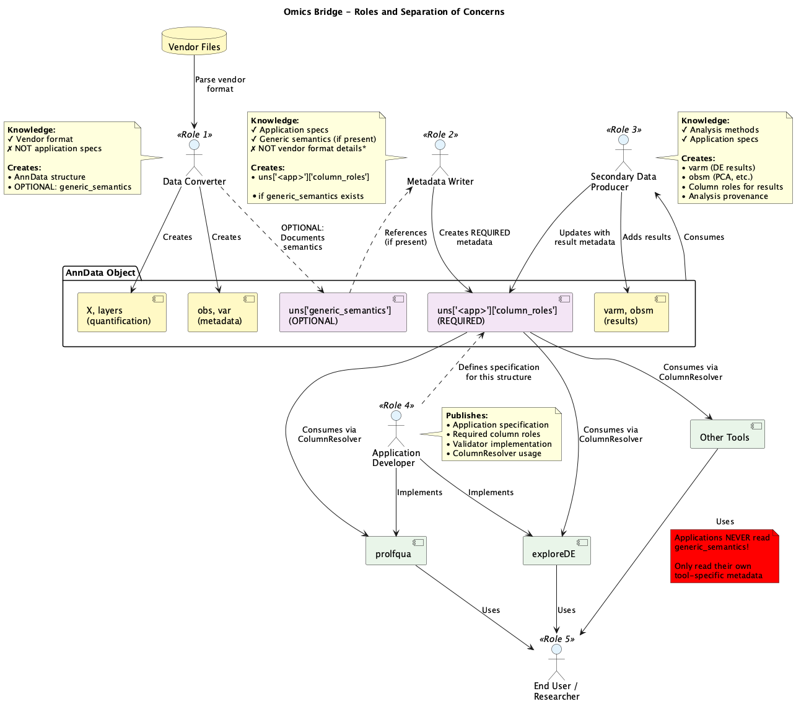
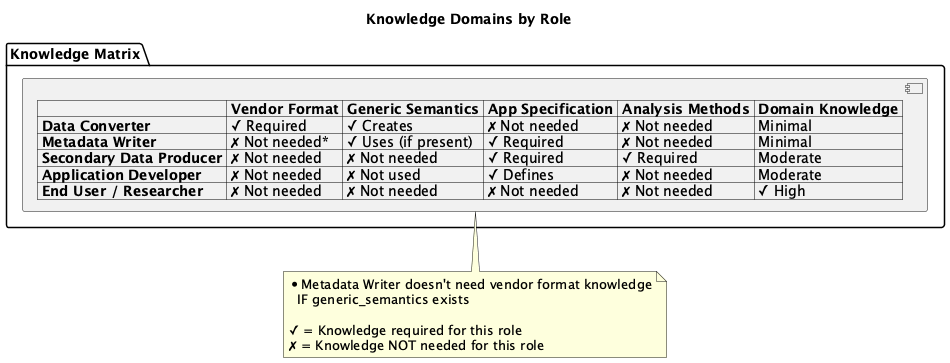
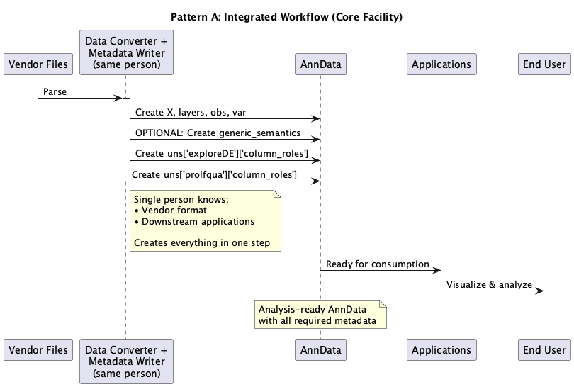
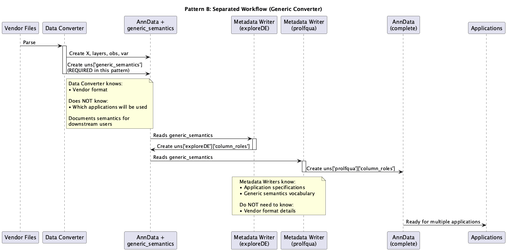
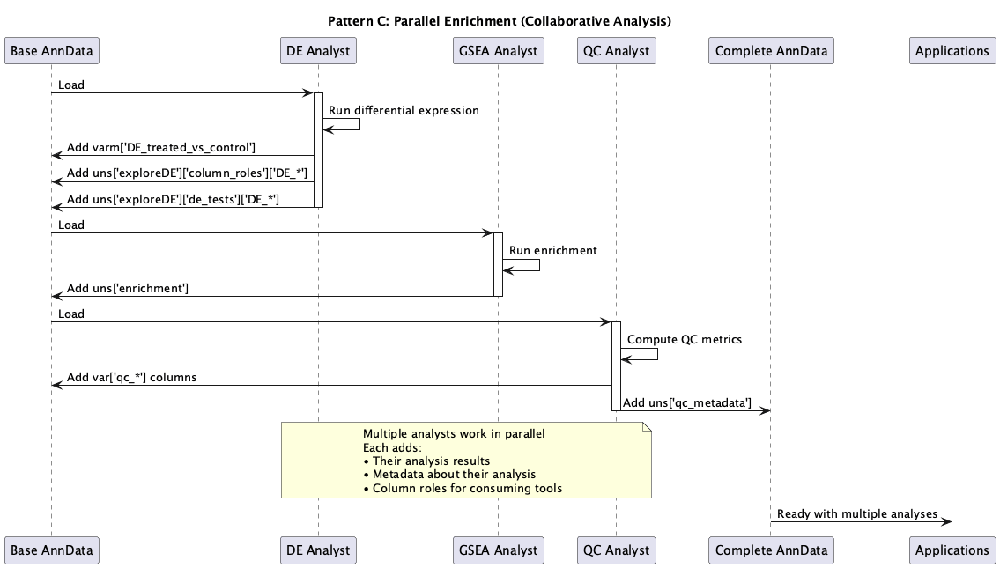

# Roles and Separation of Concerns in Omics Bridge

**Date**: 2025-11-19

**Status**: Working Document

---



## Design Principles

### 1. Tool-Specific Metadata is REQUIRED and SELF-SUFFICIENT

- Applications rely **exclusively** on `uns['<app_name>']['column_roles']`
- Must work even if `generic_semantics` doesn't exist
- Each tool is independent
- Supports **ADR Option A: Tool-Specific Namespaces**

### 2. Generic Semantics is OPTIONAL HELPER

- Created by Data Converter to document vendor format semantics
- Helps humans write tool-specific metadata
- **Applications never read it directly**
- Acts as discovery/documentation aid for humans

---

## Role Definitions

### Role 1: Data Converter

**Purpose:** Transform vendor-specific file formats into standardized AnnData format

**Responsibilities:**

- Parse vendor-specific file formats (Spectronaut, DIA-NN, MaxQuant, FragPipe, MZmine, Compound Discoverer, etc.)
- Create AnnData structure:
  - Quantification data → `X` and `layers`
  - Feature annotations → `var`
  - Sample metadata → `obs`
  - Additional metadata → `uns`
  - Decide data transformations (raw vs. log2, normalization)
- **OPTIONAL**: Create `uns['generic_semantics']` to document semantic mappings

**Generic Semantics Structure:**
```python
adata.uns['generic_semantics'] = {
    'var': {
        'description': 'Protein.Names',      # semantic role → vendor column name
        'gene_symbol': 'Gene.names',
        'protein_id': 'Protein.IDs',
        'confidence_score': 'PEP',
        'log_intensity': 'Log2.LFQ.Intensity'
    },
    'obs': {
        'sample_id': 'Raw.file',
        'instrument': 'Instrument'
    }
}
```

**Knowledge Required:**
- ✓ Vendor file format structure and semantics
- ✗ NOT: Which applications will consume the data
- ✗ NOT: Application-specific requirements

**Outputs:**
- AnnData object with data (`X`, `layers`, `obs`, `var`)
- OPTIONAL: `uns['generic_semantics']` (documentation of available semantic concepts)

---

### Role 2: Application Metadata Writer

**Purpose:** Create tool-specific column role metadata to enable application consumption

**Responsibilities:**

- Understand application requirements (exploreDE, prolfqua, etc.)
- Map vendor columns to application semantic roles
- Create `uns['<app_name>']['column_roles']` metadata
- Reference `generic_semantics` (if available) to discover what's in the data

**Example Output:**
```python
# exploreDE-specific metadata (REQUIRED for exploreDE to work)
adata.uns['exploreDE'] = {
    'column_roles': {
        'var': {
            'description': ['Protein.Names'],  # REQUIRED by exploreDE
            'label': ['Gene.names', 'Protein.IDs']
        },
        'obs': {
            'factor': ['condition', 'batch'],  # REQUIRED by exploreDE
            'label': ['sample_id']
        }
    }
}

# prolfqua-specific metadata (different requirements)
adata.uns['prolfqua'] = {
    'column_roles': {
        'var': {
            'hierarchy': ['Protein.Group', 'Stripped.Sequence'],  # REQUIRED by prolfqua
            'intensity': ['Peptide.Quantity'],
            'qvalue': ['qValue']
        },
        'obs': {
            'sample_id': ['Raw.file']
        }
    },
    'hierarchy': ['Protein.Group', 'Stripped.Sequence']  # Top-level metadata
}
```

**Knowledge Required:**

- ✓ Application specification (what roles are required)
- ✓ Generic semantics vocabulary (if using `generic_semantics` as reference)
- ✗ NOT: Vendor format details (if `generic_semantics` exists)

**Inputs:**

- AnnData from Data Converter
- Application specification document
- OPTIONAL: `uns['generic_semantics']` (makes job easier)

**Can Be:**

- Same person as Data Converter (if they know downstream applications)
- Different person (if using `generic_semantics` as documentation)
- Automated tool (if mappings are straightforward)

---

### Role 3: Secondary Data Producer (Analysis Workflow Developer)

**Purpose:** Perform statistical analyses and add derived results to AnnData

**Responsibilities:**

- Consume AnnData and perform analyses:
  - Differential expression (DE)
  - Principal component analysis (PCA)
  - Gene set enrichment analysis (GSEA/ORA)
  - Clustering
  - Quality control metrics
- Add derived results to appropriate AnnData slots:
  - DE results → `varm['DE_<contrast_name>']`
  - Dimensionality reduction → `obsm['X_pca']`, `obsm['X_umap']`
  - Enrichment results → `uns['enrichment']`
  - QC metrics → `var` columns or `uns`
- Document analysis provenance and methods
- Update/add tool-specific column_roles for results added

**Example:**
```python
# Add DE results
de_results = pd.DataFrame({
    'log2FoldChange': [...],
    'pvalue': [...],
    'padj': [...]
}, index=adata.var_names)
adata.varm['DE_treated_vs_control'] = de_results

# Document column roles for the DE results
adata.uns['exploreDE']['column_roles']['DE_treated_vs_control'] = {
    'effect': ['log2FoldChange'],
    'score': ['pvalue', 'padj']
}

# Document analysis metadata
adata.uns['exploreDE']['de_tests'] = {
    'DE_treated_vs_control': {
        'layer_used': 'vst',
        'factor_used': ['condition'],
        'contrast_formula': 'treated - control',
        'model': 'DESeq2'
    }
}
```

**Knowledge Required:**

- ✓ Statistical analysis methods
- ✓ Application specifications (for tools that will consume the results)
- ✗ NOT: Vendor format details
- ✗ NOT: Generic semantics

**Key Characteristics:**

- **Both consumer AND producer** of AnnData
- Multiple analysts can work in parallel on different analyses
- Each adds their own results and metadata

---

### Role 4: Application Developer (Contract Publisher)

**Purpose:** Define application requirements and build consuming tools

**Responsibilities:**

- Define and publish application specification (contract):
  - Required column roles in `var`, `obs`, `varm`
  - Required metadata structure
  - Data type requirements
- Implement validator to check AnnData compliance
- Build application that consumes AnnData via ColumnResolver
- Document requirements clearly for upstream data producers

**Example Specification:**

```markdown
# exploreDE Requirements

## Required in var:
- `description` role: Free-text searchable description (REQUIRED)
- `label` roles: Optional identifiers (gene symbols, protein IDs, etc.)

## Required in obs:
- `factor` role: At least one experimental factor (REQUIRED)

## Required in varm (for each DE test):
- `effect` role: Effect size columns (REQUIRED)
- `score` role: Significance columns (REQUIRED)
```

**Implementation:**

```python
from omicsbridge import ColumnResolver

def create_volcano_plot(adata, de_test_name):
    """
    Create volcano plot using column roles.
    Works with any upstream tool's column names.
    """
    resolver = ColumnResolver(adata, app_name='exploreDE')

    # Access data by semantic role, not hard-coded column names
    effect_col = resolver.de(de_test_name, 'effect')
    pval_col = resolver.de(de_test_name, 'score')

    # Plot using the actual column names from metadata
    # ...
```

**Knowledge Required:**
- ✓ Application functional requirements
- ✓ Tool-specific metadata structure design
- ✗ NOT: Vendor formats
- ✗ NOT: Generic semantics (never consumed by applications)

**Publishes:**
- Specification document
- Validator function
- ColumnResolver-based consuming code

---

### Role 5: End User / Researcher

**Purpose:** Use applications to explore and analyze data

**Responsibilities:**
- Load AnnData into applications (exploreDE, prolfqua, etc.)
- Interact with visualizations and analyses
- Filter, search, and explore results
- Export findings for further analysis or publication

**Knowledge Required:**
- ✓ Domain knowledge (biology, proteomics, etc.)
- ✓ Application usage (how to use exploreDE, etc.)
- ✗ NOT: AnnData structure details
- ✗ NOT: Column role metadata

**Interaction:**
- Typically does not interact with AnnData directly
- Works through application interfaces

---

## Knowledge Domain Matrix



| Role | Vendor Format | Generic Semantics | App Specification | Analysis Methods | Domain Knowledge |
|------|---------------|-------------------|-------------------|------------------|------------------|
| **Data Converter** | ✓ Required | ✓ Creates (optional) | ✗ Not needed | ✗ Not needed | Minimal |
| **Metadata Writer** | ✗ Not needed* | ✓ Uses (optional) | ✓ Required | ✗ Not needed | Minimal |
| **Secondary Data Producer** | ✗ Not needed | ✗ Not needed | ✓ Required | ✓ Required | Moderate |
| **Application Developer** | ✗ Not needed | ✗ Not used | ✓ Defines | ✗ Not needed | Moderate |
| **End User** | ✗ Not needed | ✗ Not needed | ✗ Not needed | ✗ Not needed | ✓ High |

*If `generic_semantics` exists, Metadata Writer doesn't need vendor format knowledge

---

## Data Flow Patterns


### Pattern A: Integrated Workflow (Core Facility)



### Pattern B: Separated Workflow (Generic Converter)



### Pattern C: Parallel Enrichment (Collaborative Analysis)



Multiple analysts add different results to same AnnData object.

```
Base AnnData
    ├─→ [DE Analyst] → adds varm['DE_*'] + metadata
    ├─→ [GSEA Analyst] → adds uns['enrichment'] + metadata
    ├─→ [QC Analyst] → adds var['qc_*'] + metadata
    └─→ [PCA Analyst] → adds obsm['X_pca'] + metadata
    ↓
All changes merged
    ↓
Complete AnnData with multiple analyses
```

**Use Case:**
- Collaborative analysis workflows
- Different experts contribute different analyses
- Each documents their contribution properly

